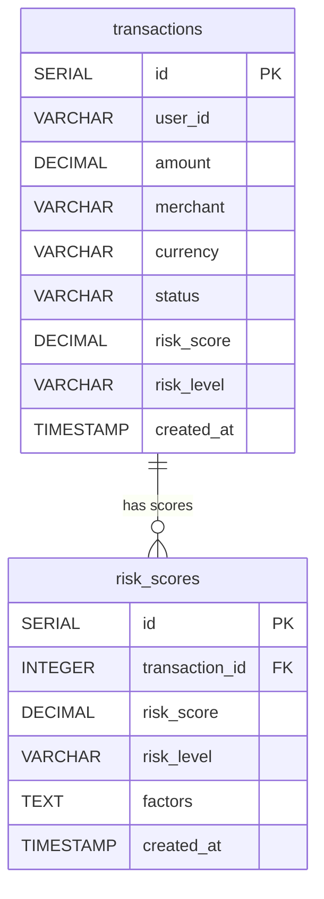

# I1 — ER Diagram from Repo

**Source repo:** `systems/fraud-score`  
**Source files:** `db/init.sql`

## Tables and Entities

| Table | Primary Key | Source |
|-------|-------------|--------|
| `transactions` | `id` (SERIAL) | `db/init.sql:1` |
| `risk_scores` | `id` (SERIAL) | `db/init.sql:12` |

## Columns

### `transactions`

| Column | Type | Source |
|--------|------|--------|
| `id` | SERIAL PK | `db/init.sql:2` |
| `user_id` | VARCHAR(64) NOT NULL | `db/init.sql:3` |
| `amount` | DECIMAL(12,2) NOT NULL | `db/init.sql:4` |
| `merchant` | VARCHAR(128) NOT NULL | `db/init.sql:5` |
| `currency` | VARCHAR(3) DEFAULT 'USD' | `db/init.sql:6` |
| `status` | VARCHAR(20) DEFAULT 'pending' | `db/init.sql:7` |
| `risk_score` | DECIMAL(5,2) | `db/init.sql:8` |
| `risk_level` | VARCHAR(10) | `db/init.sql:9` |
| `created_at` | TIMESTAMP DEFAULT NOW() | `db/init.sql:10` |

### `risk_scores`

| Column | Type | Source |
|--------|------|--------|
| `id` | SERIAL PK | `db/init.sql:13` |
| `transaction_id` | INTEGER FK → transactions(id) | `db/init.sql:14` |
| `risk_score` | DECIMAL(5,2) NOT NULL | `db/init.sql:15` |
| `risk_level` | VARCHAR(10) NOT NULL | `db/init.sql:16` |
| `factors` | TEXT | `db/init.sql:17` |
| `created_at` | TIMESTAMP DEFAULT NOW() | `db/init.sql:18` |

## Relationships

| From | To | Type | Source |
|------|----|------|--------|
| `risk_scores.transaction_id` | `transactions.id` | FK (one-to-many) | `db/init.sql:14` |

## Mermaid ER Diagram

