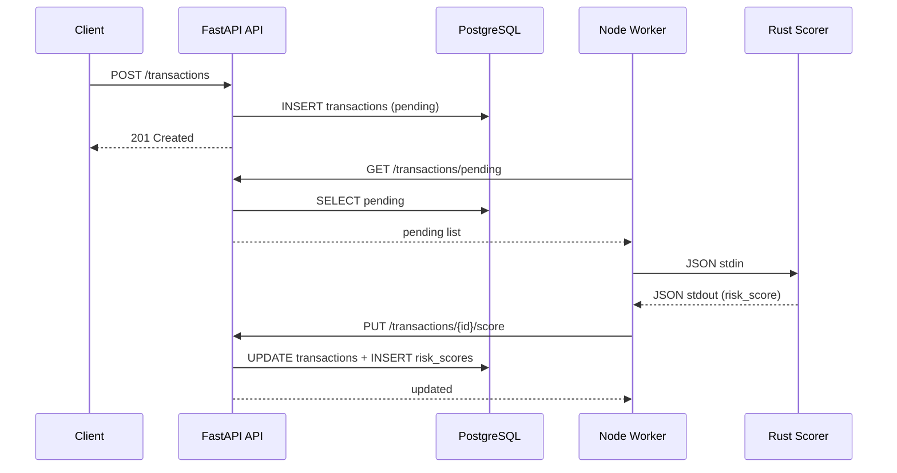

# I2 — End-to-End Flow Trace

**Flow:** Fraud score transaction ingestion → worker scoring → DB update  
**Entry point:** `POST /transactions` on fraud-score API

## Step-by-Step Path

| Step | File | Function | Action |
|------|------|----------|--------|
| 1 | `api/app/main.py` | `ingest_transaction()` | Receives HTTP POST, validates input |
| 2 | `api/app/main.py` | `get_db()` | Opens PostgreSQL connection |
| 3 | `api/app/main.py` | `ingest_transaction()` | INSERT into `transactions` with status='pending' |
| 4 | `db/init.sql` | `transactions` table | Row persisted |
| 5 | `worker/worker.js` | `fetchPending()` | Polls `GET /transactions/pending` |
| 6 | `api/app/main.py` | `get_pending_transactions()` | SELECT WHERE status='pending' |
| 7 | `worker/worker.js` | `buildScoreInput()` | Builds JSON for scorer |
| 8 | `worker/worker.js` | `scoreTransaction()` | execSync Rust CLI with JSON stdin |
| 9 | `scorer/src/main.rs` | `main()` | Reads stdin, deserializes JSON |
| 10 | `scorer/src/lib.rs` | `calculate_risk()` | Computes risk score and factors |
| 11 | `scorer/src/main.rs` | `main()` | Outputs JSON to stdout |
| 12 | `worker/worker.js` | `parseScoreOutput()` | Parses scorer JSON |
| 13 | `worker/worker.js` | `updateScore()` | PUT `/transactions/{id}/score` |
| 14 | `api/app/main.py` | `update_score()` | UPDATE transactions + INSERT risk_scores |
| 15 | `db/init.sql` | `risk_scores` table | Score row persisted |

## External Dependencies

| Dependency | Purpose |
|------------|---------|
| PostgreSQL 16 | Transaction and score persistence |
| Rust fraud-scorer binary | Risk calculation engine |
| Node.js fetch API | Worker HTTP calls |

## DB / Queue Side Effects

- INSERT into `transactions` (status: pending → processed/flagged)
- INSERT into `risk_scores` (score, level, factors)

## Sequence Diagram

## Known Uncertainty

- Worker polling interval (5s default) means scoring is not real-time; latency depends on `POLL_INTERVAL_MS`.
- If the Rust scorer binary is missing, worker logs error but does not retry with backoff (by design for simplicity).
